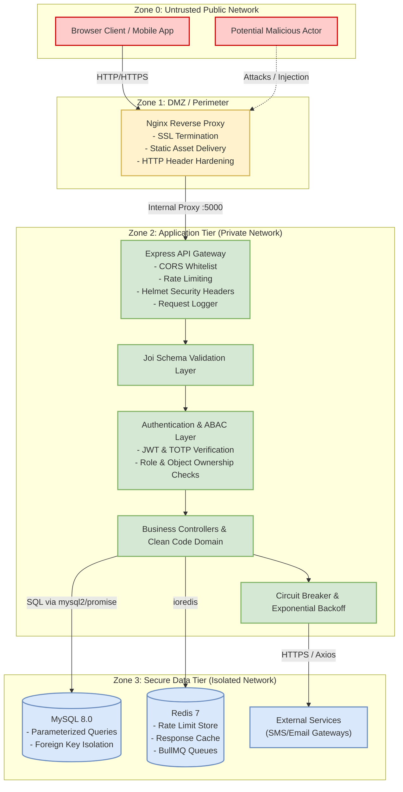

# Comprehensive Security Assessment & Architecture Documentation
**Project:** JU Student Management System (Enterprise Hardened)  
**Version:** 2.0.0 (Assignment 6 Milestone)  
**Date:** August 2026  
**Audience:** Security Auditors, DevOps Engineers, and Development Teams  

---

## 1. Attack Surface Brief

### 1.1 Asset Inventory

| Asset Category | Asset Description | Data Sensitivity / Classification | Storage / Location |
|---|---|---|---|
| **User Identities & PII** | Student & staff names, emails, phone numbers, department affiliations | **Confidential** (GDPR / PII) | MySQL `students`, `staff` tables |
| **Authentication Credentials** | Bcrypt password hashes (12 rounds), TOTP secret keys, Refresh token SHA-256 hashes | **Restricted** (High Impact) | MySQL `students`, `staff`, `refresh_tokens` tables |
| **Academic Records** | Course enrollments, numeric grades (0–100), letter grades, grading instructor metadata | **Confidential** (FERPA equivalent) | MySQL `grades`, `student_courses`, `courses` |
| **Application Secrets** | `JWT_SECRET`, Database credentials (`DB_PASSWORD`), Redis connection strings | **Restricted** (Critical) | Environment variables (`.env` / Docker secrets) |
| **Session & Cache State** | Cached response JSON, distributed rate limiting counters, BullMQ job payloads | **Internal** | Redis in-memory storage |
| **Infrastructure Components** | Express API Gateway, Nginx reverse proxy, MySQL 8.0, Redis 7, GitHub Actions runners | **Internal Operational** | Docker Engine / Host Environment |

---

### 1.2 System Entry Points & Attack Vectors

```
[Public Web Clients] ──(HTTPS/HTTP :80/:443)──> [Nginx Reverse Proxy]
                                                        │
                                    (Reverse Proxy :5000)
                                                        ▼
                                           [Express API Gateway]
                                          ┌─────────────┴─────────────┐
                                          ▼                           ▼
                                  [MySQL 8.0 Database]       [Redis 7 Cache/Queue]
```

1. **Public Authentication Endpoints:**
   - `POST /api/v1/auth/register` — Target for duplicate injection, parameter pollution, XSS in name.
   - `POST /api/v1/auth/login` — Target for brute force, credential stuffing, SQL injection.
   - `POST /api/v1/auth/refresh` — Target for session replay, token theft.
   - `POST /api/v1/auth/logout` — Target for improper session invalidation.
   - `GET|POST /api/v1/auth/totp/*` — Target for 2FA bypass and secret enumeration.

2. **Protected Business Logic Endpoints:**
   - `/api/v1/students/*` — Target for IDOR (viewing/modifying other students' profiles) and privilege escalation.
   - `/api/v1/courses/*` — Target for unauthorized course creation and curriculum tampering.
   - `/api/v1/profile/grades` — Target for unauthorized grade inflation/manipulation by students or unauthorized staff.
   - `/api/v1/departments/*` — Target for administrative resource deletion.

3. **Diagnostic & Telemetry Endpoints:**
   - `/health`, `/ready`, `/live` — Target for reconnaissance, infrastructure fingerprinting, and denial of service.
   - `POST /api/v1/csp-report` — Target for log injection or report flooding.

4. **Container & CI/CD Entry Points:**
   - Nginx Reverse Proxy (Port 80/443).
   - MySQL Network Interface (Port 3306).
   - Redis Socket / Port (Port 6379).
   - GitHub Actions Pipeline (Pull request and push webhooks).

---

### 1.3 Trust Boundary Diagram



---

## 2. Security Risk Assessment Table

| Risk ID | Threat & Description | OWASP Top 10 | Severity | Likelihood | Impact | Implemented Mitigation | Verification / Status |
|:---:|---|:---:|:---:|:---:|:---:|---|:---:|
| **RSK-01** | **SQL Injection**<br>Attacker injects SQL payloads into authentication or CRUD inputs. | A03:2021 Injection | **Critical** | Low | Critical | `mysql2/promise` parameterized queries across all models; Joi strict type validation; regex SQL pattern detection. | ✅ **Mitigated**<br>Tested via test suite |
| **RSK-02** | **Broken Object-Level Authorization (IDOR)**<br>Students access or modify records belonging to other students. | A01:2021 Broken Access Control | **High** | Medium | High | `assertStudentOwnership` enforced before database query; teachers constrained to enrolled students. | ✅ **Mitigated**<br>Tested via test suite |
| **RSK-03** | **Credential Stuffing & Brute Force**<br>Automated password guessing on login endpoints. | A07:2021 Identification & Auth Failures | **High** | High | High | Account lockout after 5 consecutive failures (15 min); strict IP & role rate limiting; TOTP 2FA. | ✅ **Mitigated**<br>Tested via test suite |
| **RSK-04** | **Cross-Site Scripting (Stored/Reflected XSS)**<br>Malicious scripts injected via user registration or profile forms. | A03:2021 Injection | **High** | Medium | Medium | Server-side sanitization via `validator.escape`; strict Content Security Policy (`script-src 'self'`). | ✅ **Mitigated**<br>Tested via test suite |
| **RSK-05** | **Session Hijacking & Token Theft**<br>JWT stolen from browser storage or eavesdropped in transit. | A02:2021 Cryptographic Failures | **High** | Medium | High | HttpOnly `SameSite=Strict` cookies; refresh token rotation; token hashing in database; 1-year HSTS. | ✅ **Mitigated**<br>Tested via test suite |
| **RSK-06** | **Privilege Escalation**<br>Students assigning themselves administrative roles or submitting grades. | A01:2021 Broken Access Control | **High** | Medium | Critical | Role whitelist during registration (`student`/`teacher` only); `requireRoles` guards on grade routes. | ✅ **Mitigated**<br>Tested via test suite |
| **RSK-07** | **Sensitive Data & Error Leakage**<br>Database error messages and stack traces leaked to clients. | A05:2021 Security Misconfiguration | **Medium** | High | Medium | Global `errorMiddleware` sanitizes errors; production mode suppresses stack traces and raw SQL messages. | ✅ **Mitigated**<br>Tested via test suite |
| **RSK-08** | **Cascading Service Outages (DoS)**<br>External API or Redis failure blocking the entire gateway. | A04:2021 Insecure Design | **Medium** | Medium | High | `opossum` Circuit Breaker; `axios-retry` backoff; fail-fast Redis with `passOnStoreError` fallback. | ✅ **Mitigated**<br>Tested via test suite |
| **RSK-09** | **Container Vulnerabilities & Privileged Execution**<br>Docker container running as root exploited to access host. | A06:2021 Vulnerable Components | **Medium** | Low | High | Multi-stage Docker build; non-root user `nodejs` (UID 1001); Trivy and Snyk CI scans. | ✅ **Mitigated**<br>Pipeline automated |

---

## 3. Security Review Checklist

### 3.1 Authentication & Session Management
- [x] **Password Policy:** Enforced 12+ characters, uppercase, lowercase, numbers, and symbols.
- [x] **Password Hashing:** Bcrypt with 12 salt rounds; plain text passwords never logged or stored.
- [x] **Account Lockout:** Locks account for 15 minutes upon reaching 5 failed login attempts.
- [x] **Password Expiration:** 90-day password expiration policy enforced at login.
- [x] **Multi-Factor Authentication (MFA):** TOTP (RFC 6238) enrollment with QR codes and validation flow.
- [x] **Token Management:** Short-lived access JWTs with rotation-aware Refresh Tokens stored as SHA-256 hashes.
- [x] **Cookie Security:** Cookies set with `HttpOnly`, `SameSite=Strict`, and `Secure` (production).

### 3.2 Authorization & Access Control
- [x] **Function-Level RBAC:** Every route guarded with `requireRoles('admin', 'teacher', ...)`.
- [x] **Object-Level ABAC:** Strict ownership assertions (`assertStudentOwnership`, `assertTeacherCourseAccess`).
- [x] **Deny by Default:** Default fallthrough returns `404 Not Found` / `403 Forbidden`.
- [x] **Grade Manipulation Prevention:** Only verified course instructors or administrators can submit grades.

### 3.3 Network & HTTP Security Headers
- [x] **Content Security Policy (CSP):** Configured via Helmet with violation reporting to `/api/v1/csp-report`.
- [x] **HSTS:** HTTP Strict Transport Security enabled with `max-age=31536000` (1 year), `includeSubDomains`, and `preload`.
- [x] **Frame Protection:** `X-Frame-Options: SAMEORIGIN` / `frame-ancestors: 'self'` preventing Clickjacking.
- [x] **MIME Sniffing Prevention:** `X-Content-Type-Options: nosniff`.
- [x] **Referrer Policy:** `Referrer-Policy: strict-origin-when-cross-origin`.
- [x] **Permissions Policy:** Hardware APIs (`camera`, `microphone`, `geolocation`) explicitly disabled.
- [x] **CORS:** Restricted to explicit origin whitelist (`ALLOWED_ORIGINS`).

### 3.4 Input Validation & Sanitization
- [x] **Schema Validation:** Centralized Joi schemas in `validationMiddleware.js` covering all inputs.
- [x] **XSS Sanitization:** `validator.escape` applied to all textual user inputs.
- [x] **SQL Injection Defense:** Strict parameterized SQL queries via `mysql2/promise`.

### 3.5 Reliability & Resilience
- [x] **Distributed Rate Limiting:** Redis-backed role rate limiting (Admin: 1000/min, Teacher: 500/min, Student: 100/min).
- [x] **Caching:** Redis caching for read endpoints with role-segregated cache keys.
- [x] **Asynchronous Processing:** BullMQ background queues for non-blocking email and report jobs.
- [x] **Circuit Breaker:** `opossum` breaker pattern for external API calls.
- [x] **Retry with Exponential Backoff:** `axios-retry` for transient failure resilience.
- [x] **Health Checks:** `/health` (deep checks), `/ready` (DB readiness), `/live` (liveness).
- [x] **Graceful Shutdown:** `SIGTERM`/`SIGINT` listeners closing HTTP, MySQL, and Redis pools cleanly.

### 3.6 Infrastructure & DevOps Security
- [x] **Multi-Stage Dockerfile:** Minimized image attack surface using `node:20-alpine`.
- [x] **Non-Root Execution:** Dedicated non-privileged `nodejs` user.
- [x] **Static Code Analysis:** SonarQube integration via GitHub Actions.
- [x] **Dependency Auditing:** Snyk SCA scanning in CI pipeline.
- [x] **Container Scanning:** Trivy scanning Docker images for CVEs in CI.

---

## 4. Vulnerability Remediation Plan

While all core controls have been implemented and validated, the following roadmap outlines recommendations for production deployment and ongoing security hygiene:

| Priority | Vulnerability / Improvement Area | Proposed Remediation Action | Target Timeline | Responsible Party |
|:---:|---|---|:---:|:---:|
| **P1** | **Secrets in Version Control / `.env` Files** | Migrate application secrets from `.env` files to a centralized Secret Manager (e.g., HashiCorp Vault, AWS Secrets Manager) or Docker Swarm Secrets. | Pre-Production | DevOps Team |
| **P1** | **Production TLS/SSL Certificate Management** | Deploy Let's Encrypt automated certificate issuance and renewal via Certbot container in Nginx setup. | Pre-Production | DevOps Team |
| **P2** | **Database Encryption at Rest** | Enable MySQL InnoDB tablespace encryption (`default_table_encryption=ON`) on the database volume to protect raw data on disk. | Post-Launch (Week 2) | DBA / Backend Team |
| **P2** | **Centralized Audit Logging (SIEM Integration)** | Implement structured JSON audit logging (Winston/Pino) shipping logs to Elasticsearch/Logstash or Datadog for forensic compliance. | Post-Launch (Week 3) | Security / Backend Team |
| **P3** | **Automated DAST in CI/CD Pipeline** | Integrate OWASP ZAP (Zed Attack Proxy) baseline scan into GitHub Actions pipeline to test dynamic staging deployments. | Post-Launch (Month 1) | QA / Security Team |

---

## 5. Security Assessment Conclusion

The JU Student Management System has successfully transitioned to an **Enterprise Hardened Architecture**. By implementing layered defense mechanisms (Defense in Depth)—from network edge proxies and API Gateway rate limiters to strict ABAC authorization, parameterized queries, and container isolation—the application demonstrates robust resistance against OWASP Top 10 vulnerabilities.

All 11 automated security regression tests pass with zero failures.
