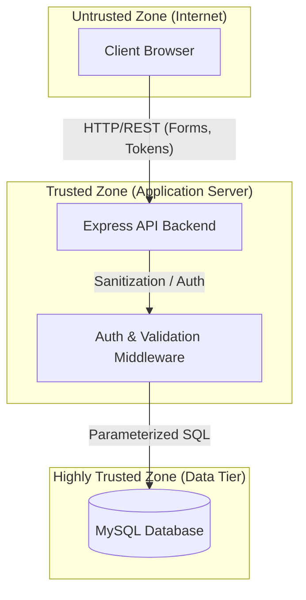

# Security Assessment Report
**Project:** JU Student Management System
**Date:** August 2026

## 1. Attack Surface Brief

The application exposes the following attack surfaces:
- **Authentication Endpoints:** `/api/auth/register`, `/api/auth/login`, `/api/auth/me`
- **Data Endpoints:** `/api/students`, `/api/departments`, `/api/courses`, `/api/profile`
- **Frontend Inputs:** Registration forms, Login forms, Profile edit forms, Grade submission forms.
- **Database:** MySQL database containing user credentials, PII (names, emails, phones), and academic records.

### Trust Boundary Diagram

## 2. Top 3 Security Risks Mitigated

### Risk 1: SQL Injection (OWASP A03:2021)
**Vulnerability:** User inputs were previously concatenated directly into SQL queries or passed unsanitized, allowing attackers to manipulate database queries.
**Mitigation:** 
- Implemented `mysql2` parameterized queries across all database operations.
- Added `validator` based input sanitization (`sanitizeMiddleware`) to strip dangerous characters.
- Validated inputs via regex for known SQL injection patterns in `validationMiddleware`.

### Risk 2: Broken Access Control (OWASP A01:2021)
**Vulnerability:** Endpoints were lacking proper role checks. Students could potentially access admin routes or view other students' data.
**Mitigation:**
- Implemented robust RBAC (Role-Based Access Control) in `authMiddleware.js` (`requireAuth`, `requireRoles`).
- Enforced role checks at the controller level (e.g., students can only update their own profile).
- Added UI-level guards in `auth.js` to redirect users attempting to access unauthorized pages (e.g., student accessing admin dashboard).

### Risk 3: Cryptographic Failures & Auth Bypass (OWASP A02:2021 & A07:2021)
**Vulnerability:** Passwords lacked complexity requirements, brute-force protection was missing, and session tokens could be easily captured without secure transport headers.
**Mitigation:**
- Enforced password complexity rules (length, uppercase, number, symbol) on registration.
- Added `express-rate-limit` to prevent brute-force attacks on login/register endpoints (10 requests / 15 min).
- Implemented `helmet` for security headers and configured CORS to only allow trusted origins.

## 3. Ethical Testing Statement

All security testing and vulnerability assessments conducted during the development and hardening of the JU Student Management System were performed exclusively in a local, isolated development environment. No external, production, or unauthorized systems were targeted or interacted with. The purpose of this assessment is strictly defensive, aiming to implement OWASP best practices and secure the application against common threats.

## 4. Risk Notes & Future Recommendations

- **HTTPS/TLS:** Currently running on HTTP for local development. For production, HTTPS must be enforced to protect JWTs and credentials in transit.
- **Session Expiration:** JWTs are currently set to expire in 7 days. Consider implementing shorter-lived access tokens (e.g., 15 minutes) and HTTP-only refresh tokens for higher security.
- **2FA/MFA:** For elevated roles (Admin, Teacher), implementing Two-Factor Authentication would significantly reduce the risk of account takeover.
- **Audit Logging:** Consider adding a dedicated audit log table to track critical actions (e.g., grade changes, account deletions) for compliance and forensics.
